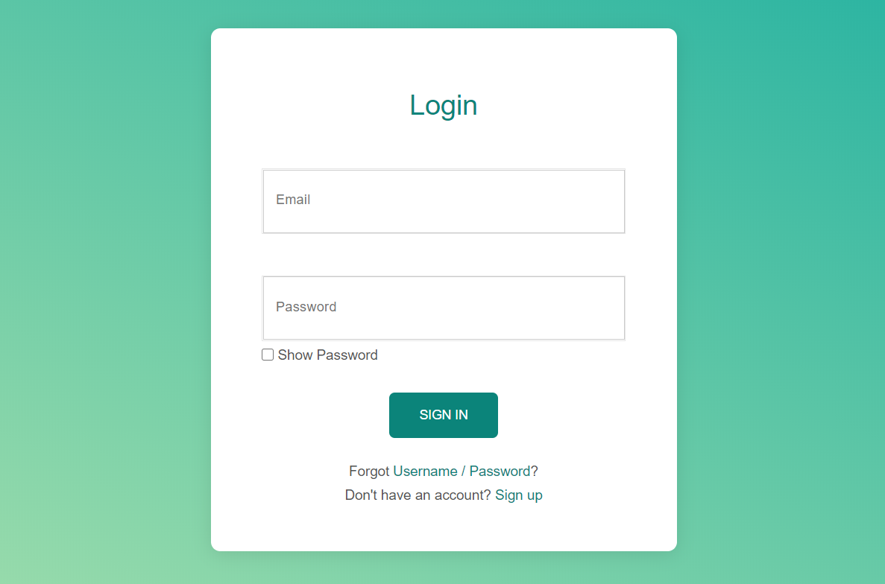
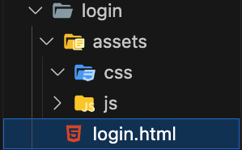
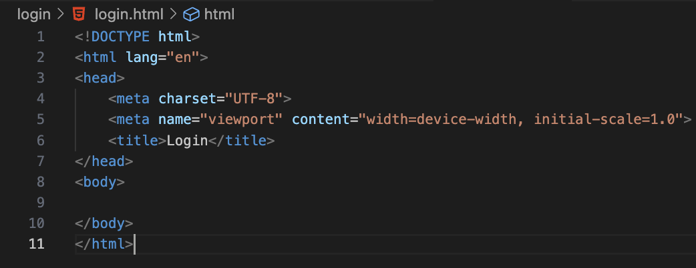

# login_exercise

# Build a login form with JavaScript validations

In this exercise, we are going to build a login form using HTML and CSS, then we are going to add validations with JavaScripts.

> A login form is used to enter authentication credentials to access a restricted page or form

The end results should look like this;



**NB** Make sure to use git branches for each step. Once you are done with a step, merge the branch of that step to the main branch and create a new one for the next step.

## Step 1

Let's build the skeleton of our login form. We will start by making sure our project structure is okay.

- Our working directory is called `login` and in it, we have the directory `assets` that contain two sub directories `css` and `js`. In the working directory, we should have our html file `login.html`



## HTML

### Step 2

Our project structure is done, now we have to add our html boilerplate in the `login.html`.

- Move to the `login.html` and in it, start typing `html`. You should see some pop-up options, select `html:5`. This should create an HTML boilerplate.
- After having created the HTML boilerplate, let's change the content of the `title` tag to `Login`. What does the `title` tag do??

We should have the following at the end



### Step 3

Time for us to build our login form. Please, follow the instructions

- Let's start by introducing a heading to indicate the kind of form we want to build. Immediately below the opening `body` tag, put the heading tag `h1`, with the content `Login`

- Every form is build in the `<form></form>` tag. Go ahead and put this tag in the body tag, just below the heading tag.

- In the `form` tag, we want four inputs. One for the email, one for the password, one for the check box, and the last one for the submit button. Let's build it together

#### email input

- Use the `<input />` tag. Remember, it is an empty tag. Meaning it doesn't require any content.
- In this tag, set the following attributes; `type`, `name`, `id` and `placeholder`.
  - Since we are dealing with emails, we should use `type="email"`.

#### password input

- Again, use the `<input />` tag.
- In this tag, set the following attributes; `type`, `name`, `id`, and `placeholder`.
  - Since we are dealing with password, we should use `type="password"`. This will encrypt the password as we type in the input box.

#### Checkbox for show password

- The checkbox is good for selecting and unselecting options. Let's add a checkbox that will enable a user to show their password without the encryption.
- Let's use the `input />` tag.
- In this tag, set the following attributes; `type`, `name`, and `id`.
  - Since we are dealing with a check box, we should use `type=checkbox`.
- Next, we need a label with the content `Show Password`. For the label, use the `<label></label>` tag. Remember that the `for` attribute of this tag should match the `id` attribute of the input tag.

#### Submit button

- Now we need a submit button to be able to submit our form.

- Let's use the `<input />` tag.
- In this tag, set the following attributes; `type`, and `value`.
  - Since we are dealing with a submit, we should use `type=submit`
    > How can you achieve the same thing with the `button` tag???

#### Links

Our login form has some links to help users who have forgotten their username and password, and also to sign up if they don't have any account.

- Let's use the `p` tag to achieve each line. Go ahead and complete these lines by making `Username`, `Password`, and `Sign Up` clickable.

```html
<p>Forgot Username/Password?</p>
<p>Don't have an account? Sign Up</p>
```

- To make something clickable, we can use the `a` tag and set the `href` attribute to the URL where we want to be redirected. For this example, let's set `href` to `#`(means direct to the same page)

## CSS

Now that we have our HTML prepared, it's time to add some styling.

> You can decide to use inline, internal or external css. But I will recommend external css.

- If you have decided to use `external css`, make sure your external css file is linked to your html with the `link` tag and place your css file in the `assets/css` folder.

```html
<!-- href should contain the path to the css file -->
<link rel="stylesheet" type="text/css" href="" />
```

### Step 4

#### Centralize the body

- Let's centralize everything in the body tag. Provide values to the code below

```css
body {
  width: ;
  margin: ;
  text-align: ;
}
```

#### Display inputs vertically.

- We will notice that all our inputs are on the same line. Let's make sure they are displayed vertically.
- We could achieve this by inserting `<br />` after every input. Also, we can use CSS. Do some research to see if it's possible with CSS.

#### Add margin to the inputs

- The inputs are close to each other. Let's add margins to space them out.
- It's a bit technical here, if we check the image above, we will see that the email and password are spaced out, but the checkbox is close to the password. Finally, the submit button and checkbox are spaced out.
- Complete the code below;

```css
input[type=""],
input[type=""] {
  margin-bottom: ;
}
```

#### Submit button

Let's style the submit button. We will notice a few thing

- The button is large
- It's color is green
- The distance between the text `SIGN IN` and the edges of the button is large. This is called **padding**.

Complete the code below and investigate the filled properties.

```css
input[type=""] {
  border: none;
  text-align: center;
  text-decoration: none;
  display: inline-block;
  cursor: pointer;
  color: ;
  padding: ;
  background-color: ;
  border-radius: ;
}
```

#### Remove underline on Links

Let's remove the underline that appears on the links `Username`, `Password`, and `Sign Up`.

```css
a {
  text-decoration: ;
}
```

#### Create a white login box with a green background

Looking at the image above, we have a green background, and a white box that contains the heading `Login` and the form itself.

- Let's add a background color to the body
- Next, let's enclose the heading and form into the container `div`. This container should have `id="login-form"`

```html
<div id="login-form">
  <h1>Login</h1>
  <form>....</form>
</div>
```

- Let's add a white background color to our `div` container. Also, let's add some margins and paddings and radius. Play around with the values and see how it changes your display.

```css
#login-form {
  background-color: ;
  padding-top: ;
  padding-bottom: ;
  margin-top: ;
  border-radius: ;
}
```

- Let's change the color of the heading.

```css
h1 {
  color: ;
}
```

- Let's increase the size of the email and password input boxes

```css
input[type=""],
input[type=""] {
  width: ;
  height: ;
}
```

- Let's align the checkbox and it's label to the left.
- We can achieve this in many ways;

  - Enclose the checkbox input and label in a container called `span` or `div`, with the class attribute set to `checkBox`.

  ```html
  <span class="checkBox">
    <input ... />
    <label ...></label>
  </span>
  ```

  - Access this container from CSS via the class name and add a margin to the right. Play with the values until you get the perfect number.

  ```css
  .checkBox {
    margin-right: ;
  }
  ```

## JavaScript

Now that we have our HTML and CSS in place, let's add some interactions.

**NB**
You may decide to use inline, internal or external JavaScript. But I recommend external JavaScript.

- if you decide to use external JavaScript, then make sure the external JavaScript file is linked to your HTML with the tag `script` immediately above the closing body tag. Make sure the `src` attribute contain the path to the javascript file and put your JavaScript file in the `assets/js` folder

```html
  ...
  <script src=""></script>
  </body>
```

### Step 5

#### Input Validation

We want to validate the email and password of the user.

- The email should end with the `@digitalcareerinstitute.org`
- The password should be of length greater than 8.

##### Validation function

A function is a container that encapsulates code to be re-use later.

- In your javascript file, create a function

```js
function validation() {
  // validation code goes here
}
```

- When the form is submitted, we want to retrieve the values of all our inputs and store them in variables

```js
function validate() {
  const email = document.forms[0].email.value;
  const password = document.forms[0].password.value;
}
```

- Now, let's validate the email. Use the `if statement` to check if email ends with `@digitalcareerinstitute.org`. If it does, return `true`. If it doesn't, return `false`.

```js
// change 'condition' with your code
if (condition) {
  return true;
} else {
  alert("email is invalid");
  return false;
}
```

- Now, let's validate password. Use the `if statement` to check if password has a length greater or equals to 8. If it does, return true. If it doesn't, return false.
- Let's replace what we did above by combining the validation of both the email and password. This is important because we want to make sure both conditions pass before a true is return.

```js
// check 'condition_for_email' and 'condition_for_password'
if (condition_for_email && condition_for_password) {
  return true;
} else {
  alert("email or password doesn't meet requirements");
  return false;
}
```

##### Add an event to the submit button

We want the validation to be initiated by the clicking of the submission button. In order to achieve this, we must add an event that will call our JavaScript function when a user press on the submit button.

- In the `form` tag, add the following event

```html
<form onsubmit="return validate();">....</form>
```

- Test the validation by;
  - inputting the email `tony@gmail.com` and password `12345678` and press on `SIGN IN`. Should the validation pass or fail?
  - Now input email: `tony@digitalcareerinstitute.org` and password: `123` and press on `SIGN IN`. Should the validation pass or fail?
  - Now, input email: `tony@digitalcareerinstitute.org` and password: `12345678` and press on `SIGN IN`. Should the validation pass or fail?

# Bonus

- Play around with the `color` and `font-family` to see if you can match it to what is displayed in the image above.
- Apply JavaScript such that when the checkbox is selected, the password is shown. But when unselected, it is encrypted.
- Apply HTML to make sure both the email and password are required fields. Meaning, if we try to submit the form without filling any of these two inputs, our HTML will tell us and the submission will not happen.
- Link the `Sign Up` link to the registration form we built in previous lessons.
- Add a hover effect to the submit button. Change the background color and adjust the text color when the button is hovered over.
- Add a smooth transition to the submit button for the background color, text color, and scale.
- As you have learned in class, you can try to activate the submit button only when required fileds are filled 
